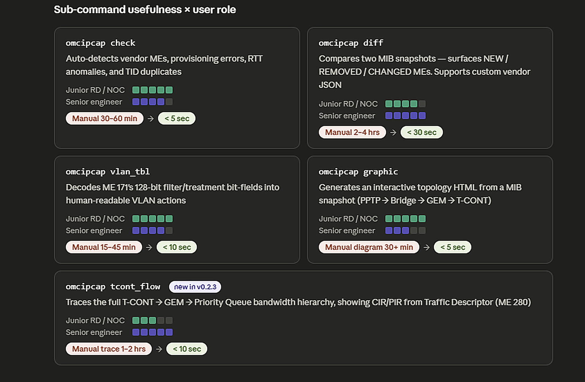

# omcipcap

[](https://pypi.org/project/omcipcap/)
[](https://pypi.org/project/omcipcap/)
[](https://github.com/daneshih1125/omcipcap/releases)
[](https://github.com/daneshih1125/omcipcap/blob/main/LICENSE)

`omcipcap` is a professional GPON/XGS-PON OMCI Semantic Analysis Framework for ITU-T G.988 protocols. By implementing a table-driven semantic engine, it transforms raw pcap data into structured, human-readable insights—covering MIB state auditing, VLAN logic decoding, and T-CONT traffic hierarchy tracing.

## 🌟 Master Branch: AI & Automation Ready
The **Master** branch represents the latest evolution, shifting from a standalone tool to an analysis framework:
- **For AI & Programmers**: Full support for **JSON IR** (`-j / --json-output`), making it easy to pipe MIB data into AI models or automation pipelines.
- **For Field Engineers**: The legacy **v0.2.x-lts** branch remains available for on-site troubleshooting with traditional CLI outputs.
- **Dual-Mode Output**: Every command supports **Rich Print** (for human diagnosis) and **JSON** (for machine processing).

## Why Use omcipcap?

`omcipcap` is built to bridge the gap between complex raw protocol data and actionable engineering insights. It significantly reduces the time required for root-cause analysis in both lab and field environments.



> **Key Impact**: Transform hour-long manual packet tracing into seconds of automated analysis, allowing engineers to focus on fixing bugs rather than finding them.

## Features

| Command | Description | Output Modes |
|---|---|---|
| `check` | Analyze RTT, TID duplicates, and ME failures | Table / JSON |
| `mibdb` | Dump the Semantic MIB Database | Table / JSON |
| `mibdb-diff` | Compare two MIBs with semantic decoding | Table / JSON |
| `vlan-tbl` | Analyze OMCI VLAN tagging logic (Table-driven) | Table / JSON |
| `tcont-flow` | Trace T-CONT → GEM → PQ traffic hierarchy | Table / JSON |
| `topology (graphic)` | Generate interactive topology HTML | Interactive HTML / JSON |


## Project Structure

```text
.
├── LICENSE         # MIT License
├── README.md       # Project documentation
├── examples        # pcap and json samples
├── omci            # Core package
├── pyproject.toml  # Build system & entry points
├── tests           # Test suites
└── utils           # pcap generators

```

## Installation
```bash=
pip install omcipcap
```
## ⚡ Quick Start (No Python Required!)

### Download Pre-compiled Binaries
Get ready-to-run executables for your platform:

- **Windows (64-bit)**: [omcipcap.exe](https://github.com/daneshih1125/omcipcap/releases/latest/download/omcipcap.exe)
- **Linux (64-bit)**: [omcipcap_linux](https://github.com/daneshih1125/omcipcap/releases/latest/download/omcipcap_linux)
- **macOS (ARM64)**: [omcipcap_mac](https://github.com/daneshih1125/omcipcap/releases/latest/download/omcipcap_mac)

No Python installation required!

### Windows and Linux Usage

```bash
# Windows
omcipcap.exe check your_file.pcap

# Linux
chmod +x omcipcap_linux
./omcipcap_linux check your_file.pcap
```

## Sub-Command
### omcipcap check
Analyze a pcap file to display a summary of all OMCI packets:
```
omcipcap check examples/omcicheck_example.pcap
```


omcipcap check with --rtt-threshold argument
```bash
(venv) $ omcipcap check --rtt-threshold=1500 omcicheck_example.pcap
 ───────────────────────────────────────────────────────────────────────────────────────────────────────────────────────────────────────────────────────────
   No.   ID   Action            ME Class   ME Instance   Result                      RTT   Status            ME desc
 ───────────────────────────────────────────────────────────────────────────────────────────────────────────────────────────────────────────────────────────
   38    19   MIB_UPLOAD_NEXT   241        0x0001                                      0                     Reserved for vendor-specific managed entities
   40    20   MIB_UPLOAD_NEXT   350        0x0001                                      0                     Reserved for vendor-specific use
   52    26   MIB_UPLOAD_NEXT   500        0x000a                                      0                     Reserved for future standardization
   58    29   CREATE            84         0x0001        Err: INSTANCE_EXISTS   0.000033                     VLAN tagging filter data
   59    30   SET               241        0x0001                                      0                     Reserved for vendor-specific managed entities
   60    30   SET               241        0x0001        Err: UNKNOWN_ME        0.000033                     Reserved for vendor-specific managed entities
   64    32   GET               257        0x0000                                      0   [TID_DUPLICATE]   ONT2-G
 ───────────────────────────────────────────────────────────────────────────────────────────────────────────────────────────────────────────────────────────
Summary: Found 2 failures, 5 Vendor packets, 1 duplicate packets, 0 late packets
```
### omcipcap mibdb
MIB Database Dump

Dump all or filtered MIB instances from a pcap.

```bash
omcipcap mibdb examples/omci.pcap
omcipcap mibdb --class-id 84,171 examples/omci.pcap
omcipcap mibdb --only-upload examples/omci.pcap
```

### omcipcap mibdb-diff
 Analyze two pcap files to identify differences in MIB provisioning
```bash
omcipcap mibdb-diff mib_vendor_v1.pcap mib_vendor_v2.pcap
omcipcap mibdb-diff mib_vendor_v1.pcap mib_vendor_v2.pcap --mib-json examples/vendor_355.json
omcipcap mibdb-diff --full ont1.pcap ont2.pcap
omcipcap mibdb-diff --full --class-id=84,171 ont1.pcap ont2.pcap
```

Example Output
When comparing a vendor-specific configuration (Class 355), omcidiff provides a clear view of the state change:
```Plaintext
(venv) $ omcipcap mibdb-diff mib_vendor_v1.pcap mib_vendor_v2.pcap --mib-json examples/vendor_355.json
 ──────────────────────────────────────────────────────────────────────────────────────────────────────────────────────
   Status         ME Name (ID)                                           Inst   Attribute          Pcap 1     Pcap 2
 ──────────────────────────────────────────────────────────────────────────────────────────────────────────────────────
   MODIFIED       Reserved for vendor-specific use (355)                  0x0   CPE mode           HGU        SFU
   MODIFIED       Reserved for vendor-specific use (355)                  0x0   Support VOIP       0x1        0x0
 ──────────────────────────────────────────────────────────────────────────────────────────────────────────────────────
Summary: Added: 0, Removed: 0, Modified: 2
```

Advanced: Custom ME JSON Format
To define your own Vendor MEs for the --mib-json flag, use the following structure:
```json
{
  "355": ["HWTC 355 ME", [
    ["CPE mode", 3, "str", False],
    ["Support VOIP", 1, "u8", False]
  ]]
}
```

### omcipcap topology 
```
omcipcap topology omci.pcap -o example.html
```


### omcipcap vlan-tbl
```
omcipcap vlan_tbl omci.pcap
```
List All ME 171 instances and detail of VLAN table


### omcipcap tcont-flow
```
omcipcap tcont-flow single_unit_1_tont_2_gem.pcap
```
Traces the complete upstream traffic hierarchy from T-CONT → GEM Port → Priority Queue and displays bandwidth/scheduling parameters in a tree view.

Example Output:
```plaintext
(venv) $ omcipcap tcont-flow single_unit_1_tont_2_gem.pcap
GPON T-CONT Flow Analysis
├── T-CONT 32768 (alloc-id=1000)
│   ├── GEM 1001
│   │   ├── [US] PQ 32775 → up:CIR=0.128Mbps/PIR=9953.28Mbps
│   │   └── [DS] PQ 0 → Priority 0 dn:Unrestricted
│   └── GEM 1002
│       ├── [US] PQ 32768 → up:CIR=0.128Mbps/PIR=100Mbps
│       └── [DS] PQ 6 → Priority 6 dn:Unrestricted
└── T-CONT 32769 (Unassigned)
(venv) $
```

Each T-CONT entry shows:
- **alloc-id**: The Alloc-ID assigned by the OLT; `Unassigned` means the T-CONT has not been activated (Alloc-ID = 0xFFFF).
- **GEM ports**: All GEM Port Network CTPs bound to this T-CONT.
- **[US] PQ**: Upstream Priority Queue with CIR/PIR bandwidth limits.
- **[DS] PQ**: Downstream Priority Queue with scheduling priority.

## License & Copyright
**Copyright (c) 2026 Dong-Yuan Shih <daneshih1125@gmail.com>
Licensed under the MIT License.**
